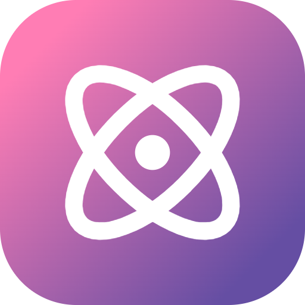
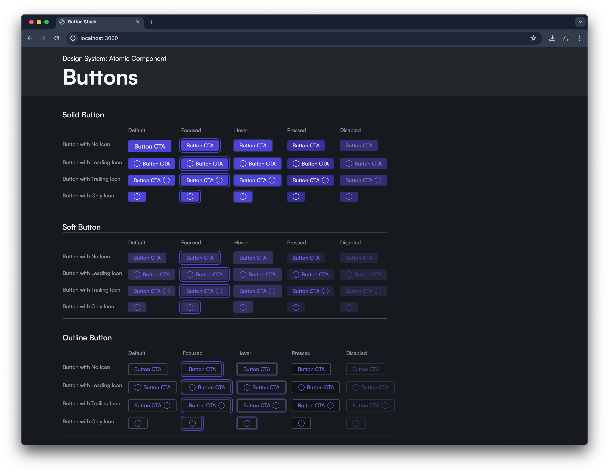
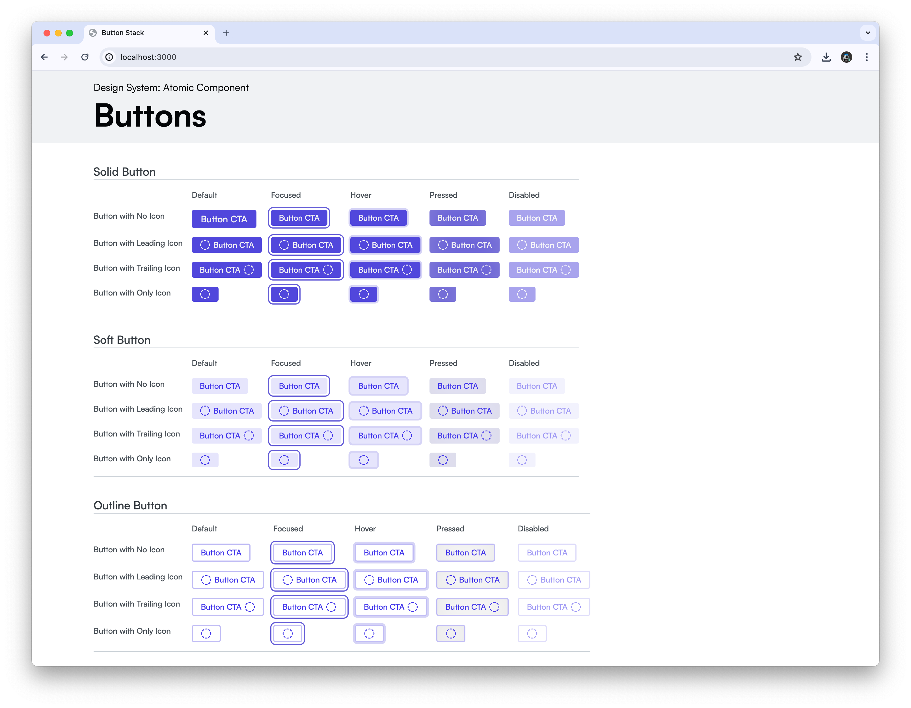

<!-- PROJECT LOGO -->
<div align="center">
    <a href="https://github.com/BrinsilElias/button-stack">
        
    </a>
    <h3 align="center">Atomic Component: Buttons</h3>
    <p align="center">
        Atomic Component's button collection offers a powerful toolkit for crafting the perfect call-to-action elements for your web interfaces.
        <br />
        <br />
        <a href="#" target="_blank">View Demo</a>
        ·
        <a href="https://github.com/BrinsilElias/button-stack/issues">Report Bug</a>
        ·
        <a href="https://github.com/BrinsilElias/button-stack/issues">Request Feature</a>
    </p>
</div>

<!-- TABLE OF CONTENTS -->
<details>
    <summary>Table of Contents</summary>
    <ol>
        <li>
            <a href="#about-the-project">About The Project</a>
            <ul>
                <li><a href="#built-with">Built With</a></li>
            </ul>
        </li>
        <li>
            <a href="#getting-started">Getting Started</a>
            <ul>
                <li><a href="#prerequisites">Prerequisites</a></li>
                <li><a href="#setup">Installation</a></li>
            </ul>
        </li>
        <li><a href="#usage">Usage</a></li>
        <li><a href="#roadmap">Roadmap</a></li>
        <li><a href="#contributing">Contributing</a></li>
        <li><a href="#license">License</a></li>
        <li><a href="#contact">Contact</a></li>
        <li><a href="#acknowledgments">Acknowledgments</a></li>
    </ol>
</details>

<!-- ABOUT THE PROJECT -->
## About The Project



This collection of button components adheres to the principles of Atomic Design. Each button is constructed as a self-contained, and reusable element. This modular approach allows for maximum flexibility and ease of customization when building out your web interfaces.


<p align="right">(<a href="#readme-top">back to top</a>)</p>

### Built With


<p align="right">(<a href="#readme-top">back to top</a>)</p>

<!-- GETTING STARTED -->
## ⛳ Getting Started

### Prerequisites

Please ensure you have Node.js installed on your machine, version 18 or greater. You can download it from the official website [NodeJs](https://nodejs.org/).

#### Clone starter-template into a new folder
```sh
mkdir new-project-name && cd $_
```
```sh
git clone --depth=1 https://github.com/BrinsilElias/button-stack.git && rm -rf ./.git
```
OR (essentially the same thing with npx + degit)

```sh
npx degit BrinsilElias/button-stack#main
```

#### Install tools and spin it up
1. `npm i` or `npm install` - Install all dependencies
2. `npm start` - Start the development Server
3. `npm run build` - Build static assets

<p align="right">(<a href="#readme-top">back to top</a>)</p>

<!-- USAGE EXAMPLES -->
## Usage

Use this space to show useful examples of how a project can be used. Additional screenshots, code examples and demos work well in this space. You may also link to more resources.

For more examples, please refer to the [Documentation](https://example.com)

<p align="right">(<a href="#readme-top">back to top</a>)</p>

<!-- ROADMAP -->
## 🚧 Roadmap

See the [open issues](https://github.com/BrinsilElias/button-stack/issues) for a list of proposed features (and known issues).

<p align="right">(<a href="#readme-top">back to top</a>)</p>

<!-- CONTRIBUTING -->
## 🤝 Contributing

Contributions are what make the open source community such an amazing place to be learn, inspire, and create. Any contributions you make are **extremely appreciated**.

1. Fork the Project
2. Create your Feature Branch (`git checkout -b feature/AmazingFeature`)
3. Commit your Changes (`git commit -m 'Add some AmazingFeature'`)
4. Push to the Branch (`git push origin feature/AmazingFeature`)
5. Open a Pull Request

<p align="right">(<a href="#readme-top">back to top</a>)</p>

<!-- LICENSE -->
## 📝 License
Distributed under the MIT License. See `LICENSE` for more information.

<!-- CONTACT -->
## 📫 Contact

Brinsil Elias - [@BrinsilE](https://twitter.com/BrinsilE)

Project Link: [https://github.com/BrinsilElias/button-stack](https://github.com/BrinsilElias/button-stack.git)

<!-- ACKNOWLEDGEMENTS -->
## Acknowledgements
* [open-props](https://open-props.style)
* [Adam Argyle](https://github.com/argyleink)

<p align="right">(<a href="#readme-top">back to top</a>)</p>